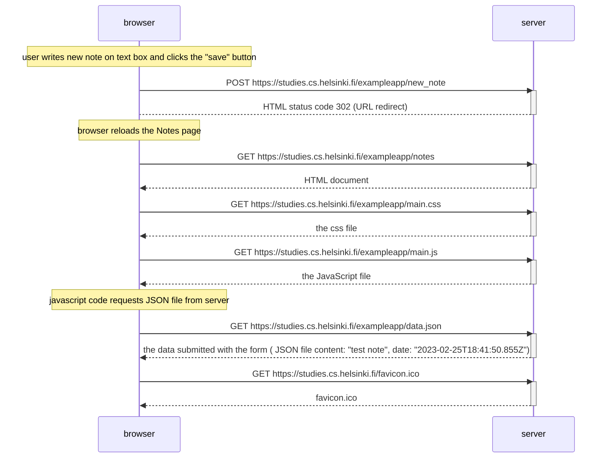

```mermaid
sequenceDiagram
    Note over browser:  user writes new note on text box and clicks the "save" button
    browser->>server: POST https://studies.cs.helsinki.fi/exampleapp/new_note
    activate server
    server-->browser: HTML status code 302 (URL redirect)
    deactivate server
    Note over browser: browser reloads the Notes page
    browser->>server: GET https://studies.cs.helsinki.fi/exampleapp/notes
    activate server
    server-->>browser: HTML document
    deactivate server
    browser->>server: GET https://studies.cs.helsinki.fi/exampleapp/main.css
    activate server
    server-->>browser: the css file
    deactivate server
    browser->>server: GET https://studies.cs.helsinki.fi/exampleapp/main.js
    activate server
    server-->>browser: the JavaScript file
    deactivate server
    
    
    Note over browser: javascript code requests JSON file from server
    browser->>server: GET https://studies.cs.helsinki.fi/exampleapp/data.json
    activate server
    server-->>browser: the data submitted with the form ( JSON file content: "test note", date: "2023-02-25T18:41:50.855Z")
    deactivate server
    browser->>server: GET https://studies.cs.helsinki.fi/favicon.ico
    activate server
    server-->>browser: favicon.ico
    deactivate server
    
    
```
