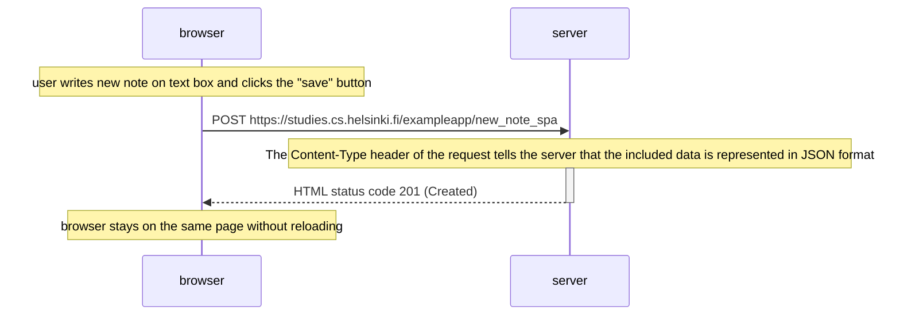

```mermaid
sequenceDiagram
    Note over browser:  user writes new note on text box and clicks the "save" button
    browser->>server: POST https://studies.cs.helsinki.fi/exampleapp/new_note_spa
    Note over server: The Content-Type header of the request tells the server that the included data is represented in JSON format
    activate server
    server-->>browser: HTML status code 201 (Created)
    deactivate server

    Note over browser:browser stays on the same page without reloading
```
